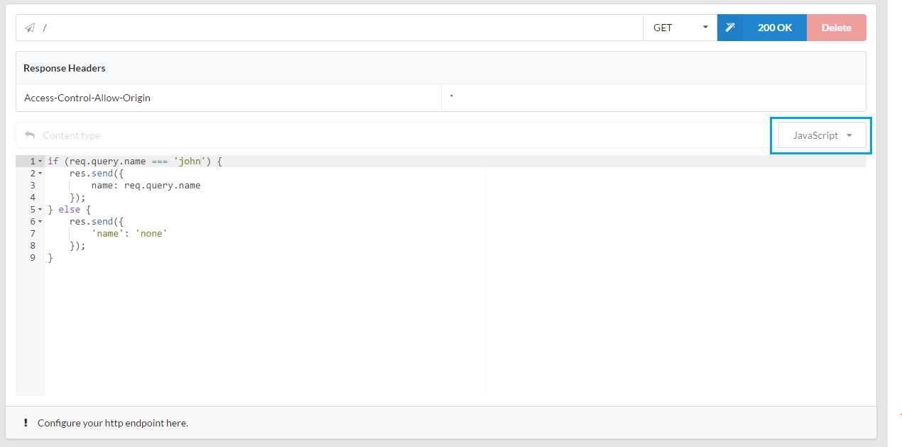

# How to send conditional response or handle query parameters
Http endpoints usually sends a specific response back. But what if you want to send conditional response based on query parameters. Atmo allows you to write a piece of code snippet
which runs when the endpoint is accessed. This snippet could decide what response to send back based on conditions.

Make sure to select `JavaScript` in the response type and write the JavaScript.

You have access to the express js request and response objects through the `req` and `res` identifiers.
