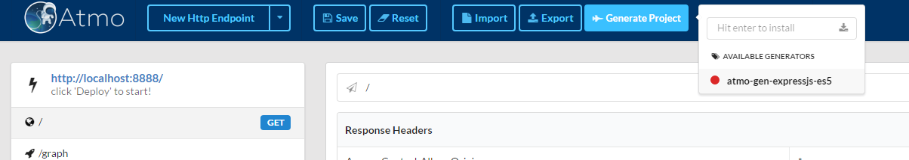

# Generating project via generators
Atmo has generators which allows you generate source code which you could use to make changes or deploy it.

In the header, click the `Generate Project` button which will open a popup. You will get list of all the generators installed.
Atmo comes with the default `atmo-gen-expressjs-es5` generator. Click on it and the generated code will be availble in a folder called `project` in the current working directory.
