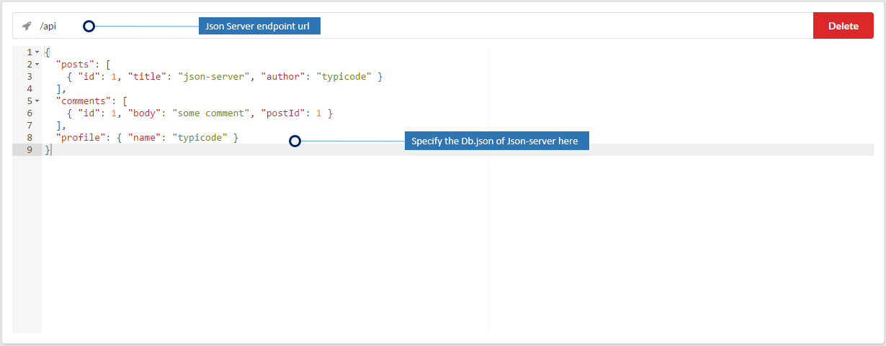

#How to create a Json server endpoint with Atmo
[Json-server](https://github.com/typicode/json-server) is an amazing tool to create mock apis. Atmo comes with [json-server](https://github.com/typicode/json-server) inbuilt.

Specify the db.json content in the UI and you will get all the features of json-server on the specified url. [Refer json-server docs for more.](https://github.com/typicode/json-server) You could change the content of the db.json and re-deploy and see the changes take effect immediately.
