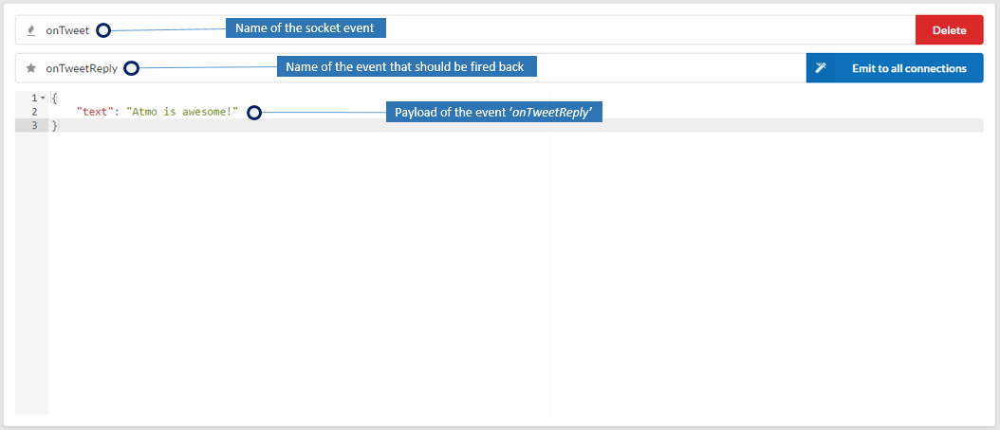
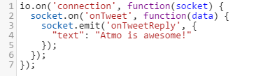
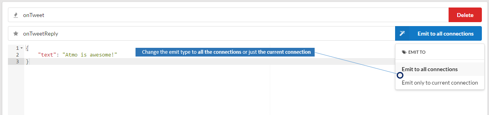
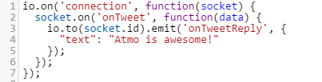

#How to create a socket endpoint with Atmo
Atmo uses [Socket.io](http://socket.io/) to create socket endpoints. The UI is pretty simple as described below.



The above endpoint is the equivalent of the following code.



## Emit to all connections or the current
Your could choose weather the event should be emitted back to all the connected clients or just the current connection as shown below.



If you set the emit type to 'Emit only to current connection' which is the equivalent of the following code.



## Connecting to atmo socket server
If the Atmo api server is running at `http://localhost:8888`, you could connect to server as you would connect to any Socket-IO server. 

````javascript
var socket = io.connect("http://localhost:8888");
  socket.on("connect", function () {
    socket.emit("onTweet", "Hello, Human!");  
  }
});
`````
